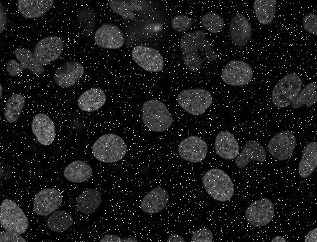

# Cell Detection from Noisy Microscopic Images

## Overview
This project focuses on detecting cells from grayscale microscopic images that contain significant noise. The approach involves **noise reduction, segmentation, connected components analysis, and feature extraction** to accurately identify and label individual cells.

## Features
- **Noise Reduction:** Uses a **median filter** to remove salt-and-pepper noise while preserving cell structures.
- **Segmentation & Connected Components:** Applies **thresholding** and **connected components labeling** to identify individual cells.
- **Bounding Box Extraction:** Extracts and filters bounding boxes around detected cells.
- **Integral Image Analysis:** Computes **area and intensity** values within bounding boxes for further analysis.
- **Final Visualization:** Displays and saves the processed image with labeled bounding boxes around detected cells.

## File Structure
```
├── median_filter.py         # Applies median filtering for noise reduction
├── cell_detection.py        # Detects and labels cells in the filtered image
├── images/                  # Contains example input and output images
├── README.md                # Project documentation
```

## Example Results
**Input Image (Noisy):**  


**Output Image (Cells Detected):**  

