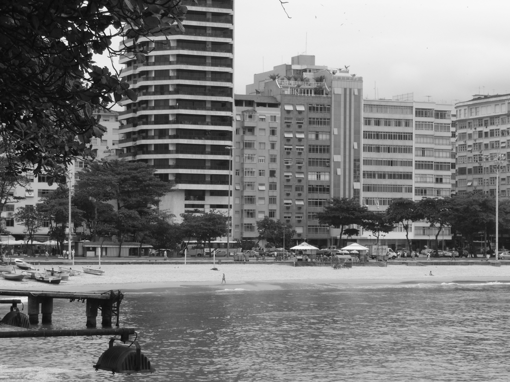
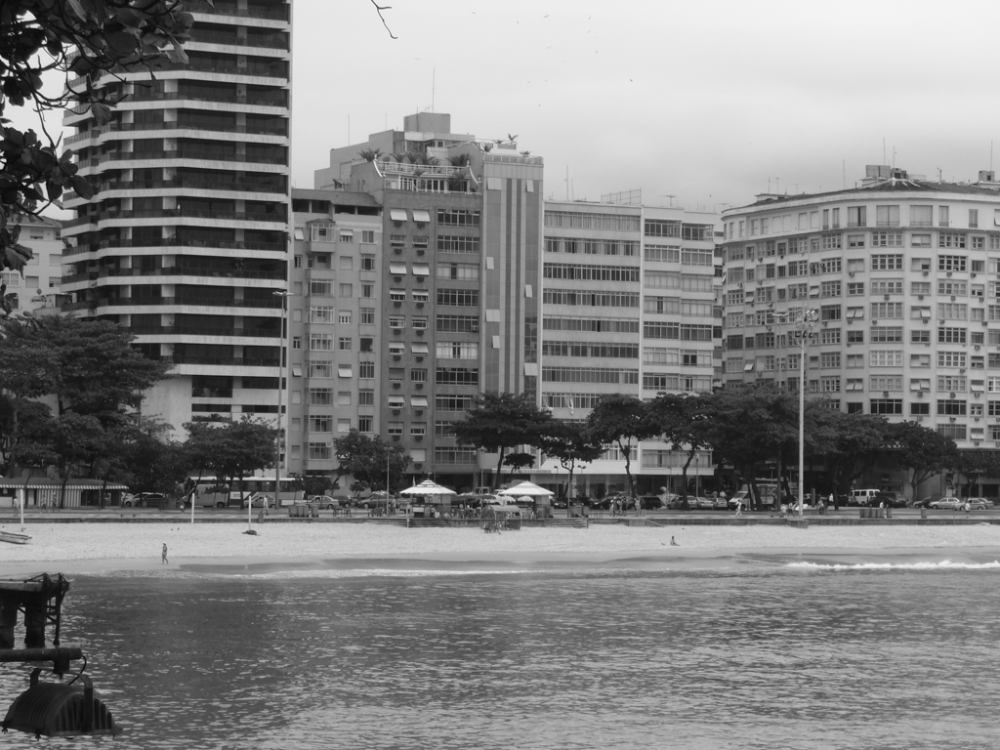
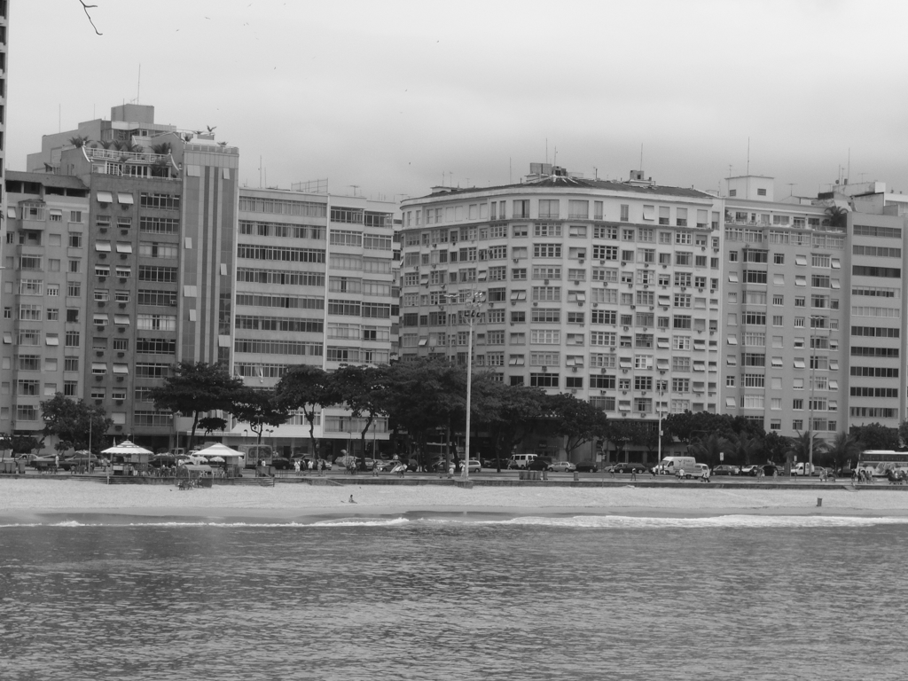
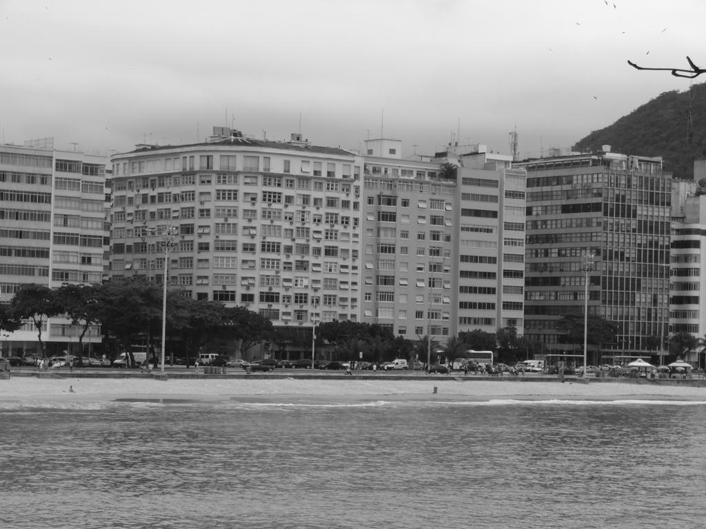
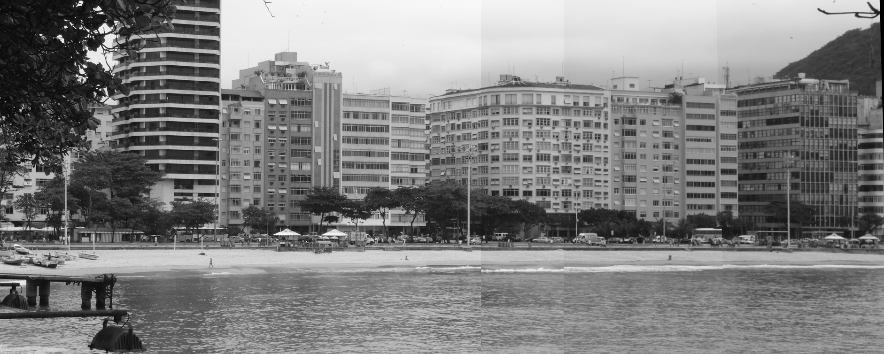

# SIFT-Based Image Stitching

## Overview
This project demonstrates how to use **SIFT (Scale-Invariant Feature Transform)** to automatically detect and match keypoints between images and stitch them into a seamless panorama. The input consists of four images taken in sequence, which are then aligned and blended to create a final composite image.

## Features
- **Keypoint Detection:** Uses SIFT to detect distinctive features in each image.
- **Feature Matching:** Matches keypoints between consecutive images using FLANN-based matching.
- **Homography Estimation:** Computes the transformation matrix for image alignment.
- **Image Warping & Stitching:** Uses perspective transformation to align and blend images.
- **Cropping & Refinement:** Removes black areas to produce a cleaner final output.

## Input Images
The project uses the following images as input:

| Image 1 | Image 2 | Image 3 | Image 4 |
|---------|---------|---------|---------|
|  |  |  |  |

## Output Image
After processing the input images, the final stitched panorama is:

## How It Works
1. **Load Images:** The four input images are loaded in grayscale.
2. **Detect Keypoints & Descriptors:** SIFT detects keypoints and computes descriptors for each image.
3. **Match Features:** Keypoints are matched between consecutive images.
4. **Compute Homography:** Transformation matrices are computed for image alignment.
5. **Warp & Stitch Images:** Images are warped and blended to create a panoramic view.
6. **Crop Final Image:** Any black borders are removed for a cleaner result.

## Source
The original dataset used in this project can be found at:  
[Dataset Source](https://vc.ee.duth.gr:6960/index.php/s/QCb6Q5E9lqXjGt4)
